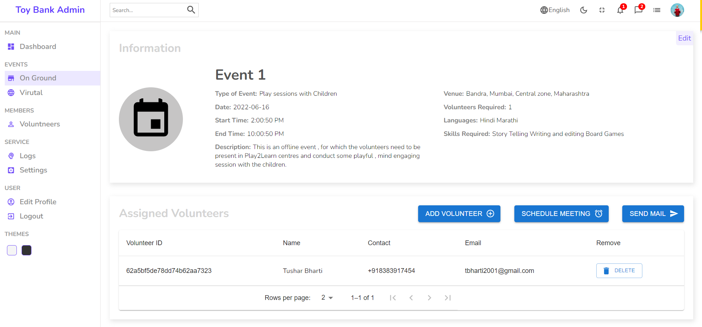
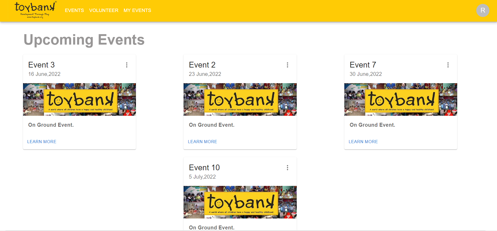

### _TOYBANK SYSTEM_


#### Overview

_Toybank System is a web application which is used to connect Admin to Volunteers and vice versa. Our objectives for this project are -_

- _Designed an effective system where Admins can easily connect with Volunteers and vice versa._
- _Map the volunteers to the scheduled events based on skills,location,languages known,availability._
- _Designed an easy interface for the volunteers to get updated about event details._

#### Technology used

_The following technologies will be used to make this application -_
- _Express_
- _MongoDB_
- _NodeJS_
- _React_
- _Javascript_

  

#### PPT LINK
[Link](https://www.canva.com/design/DAFDXjVC8Rk/I3oN9AVzVnYUSFArhbNuXQ/view?utm_content=DAFDXjVC8Rk&utm_campaign=designshare&utm_medium=link&utm_source=publishsharelink)

<!-- #### demo video LINK
still working -->


#### WEBSITE LINK
<!-- --link--  -->
[Backend API Link](https://toyban-backend.herokuapp.com/)  
[Admin Portal Link](https://toybank-admin-frontend.web.app/)  
[Volunteer Portal Link](https://toybank-volunteer-frontend.web.app/)  


#### Screenshots/Demo Video

#### _ADMIN_
##### 1) Admin Dashboard

##### 2) Event List Page      

##### 3) Event Details 


#### _VOLUNTEER_
##### 1) Landing Page

##### 2) My Events Page

##### 3) set Availability 


<!-- _Add some screens and a demo_ -->

# Documentation


# **Code to give toy bank project backend**


## Onground events realted route  
### 1. Creating onground events
```javascript
Request 
Type: POST
URL: HOST_URL +  '/api/onGroundEvents/create/'
BODY: 
    {
    "name": "event 1",
    "date": "2022-06-07",
    "StartTime": "3:00 PM",
    "EndTime": "4:00 PM",
    "typeOfEvent": "something",
    "description":"something is going to happen for sure",
    "noOfVolunteersRequired": "2",
    "typeOfVolunteers": "professional",
    "languagesRequired": ["English", "Hindi"],
    "skillsRequired":["computer"],
    "venue": "at one of the centeres",
    "town": "Andheri",
    "district":"North District",
    "city":"Mumbai"
}
Response: 
1. Event has created
   status - 201
   response -{
                created doc of event
            }
2. Some error occured
    status - 400
    response - {
        message : "error"
    }
```
### 2. Editing onground events
```javascript
Request 
Type: POST
URL: HOST_URL +  '/api/onGroundEvents/edit/:id' // here id is the object of the event document stored in mongodb
BODY: 
    {
    "name": "event 1",
    "date": "2022-06-07",
    "StartTime": "3:00 PM",
    "EndTime": "4:00 PM",
    "typeOfEvent": "something",
    "description":"something is going to happen for sure",
    "noOfVolunteersRequired": "2",
    "typeOfVolunteers": "professional",
    "languagesRequired": ["English", "Hindi"],
    "skillsRequired":["computer"],
    "venue": "at one of the centeres",
    "town": "Andheri",
    "district":"North District",
    "city":"Mumbai"
}
Response: 
1. Event has edited
   status - 201
   response -{
                created doc of event
            }
```
### 3. Deleting onground events
```javascript
Request 
Type: POST
URL: HOST_URL +  '/api/onGroundEvents/delete/:id'
BODY: 
    {}
Response: 
1. Event has been Deleted
   status - 201
   response -{
        message: "EVENT_DELETED"
}
```
### 4. Sending Mail to All the volunteers assigned
```javascript
Request 
Type: POST
URL: HOST_URL +  '/api/onGroundEvents/sendMail'
BODY: 
        {
    "id": "Event Objectid",
    "message": "message Entered"
}
    
Response: 
1. Mail sent
   status - 201
   response -{
        message: "MAIL_SENT"
}
```
## Virtual events realted route  
### 1. Creating virtual events
```javascript
Request 
Type: POST
URL: HOST_URL +  '/api/virtualEvents/create/'
BODY: 
   {
    "name": "event 1",
    "date": "2022-06-07",
    "StartTime": "3:00 PM",
    "EndTime": "4:00 PM",
    "typeOfEvent": "something",
    "description":"something is going to happen for sure",
    "noOfVolunteersRequired": "2",
    "typeOfVolunteers": "professional",
    "languagesRequired": ["English", "Hindi"],
    "skillsRequired":["computer"],
    "linksIfAny": "https:somthing.com"
}
Response: 
1. Event has created
   status - 201
   response -{
                created doc of event
            }
2. Some error occured
    status - 400
    response - {
        message : "error"
    }
```
### 2. Editing onground events
```javascript
Request 
Type: POST
URL: HOST_URL +  '/api/virtualEvents/edit/:id' // here id is the object of the event document stored in mongodb
BODY: 
   {
    "name": "event 1",
    "date": "2022-06-07",
    "StartTime": "3:00 PM",
    "EndTime": "4:00 PM",
    "typeOfEvent": "something",
    "description":"something is going to happen for sure",
    "noOfVolunteersRequired": "2",
    "typeOfVolunteers": "professional",
    "languagesRequired": ["English", "Hindi"],
    "skillsRequired":["computer"],
    "linksIfAny": "https:somthing.com"
}
Response: 
1. Event has edited
   status - 201
   response -{
                created doc of event
            }
```
### 3. Deleting onground events
```javascript
Request 
Type: POST
URL: HOST_URL +  '/api/virtualEvents/delete/:id'
BODY: 
    {}
Response: 
1. Event has been Deleted
   status - 201
   response -{
        message: "EVENT_DELETED"
}
```
### 4. Sending Mail to All the volunteers assigned
```javascript
Request 
Type: POST
URL: HOST_URL +  '/api/onGroundEvents/virtualEvents'
BODY: 
        {
    "id": "Event Objectid",
    "message": "message Entered"
}
    
Response: 
1. Mail sent
   status - 201
   response -{
        message: "MAIL_SENT"
}
```


## Volunteer Events Realted Routes  
### 1. Email verification
```javascript
Request 
Type: POST
URL: HOST_URL +  '/api/util/sendOtp/'
BODY: {
    "email": email of the volunteer
}
Response: 
1. If server failed to send the otp for some reason
   status - 410
   response -{
             "message": "OTP_SENT_FAILED"
            }
 
2. OTP sent
    status - 201
    response - {
                 message: "OTP_SENT"
           }
```

### 2. Otp Verification

```javascript
Request 
Type: POST
URL: HOST_URL +  '/api/util/verifyOtp/'
BODY: {
    "email": email of the volunteer
    "otp": otp entered
}
Response: 
1.  
   status - 401
   response -{
             "message": "OTP_EXPIRED"
            }
 
2.  
   status - 402
   response -{
             "message": "WRONG_OTP"
            }
 
3. Email not found
    status - 404
    response - {
                 message: "EMAIL_NOT_FOUND"
           }
4. OTP_VERIFIED
    status - 201
    response - {
                 message: "OTP_VERIFIED"
           }
```
### 3. Sending Mail to a particular volunteer
```javascript
Request 
Type: POST
URL: HOST_URL +  '/api/volunteers/sendMail'
BODY: 
        {
    "id": "Volunteer Objectid",
    "message": "message Entered"
}
    
Response: 
1. Mail sent
   status - 201
   response -{
        message: "MAIL_SENT"
}
```


## Contributor
[Nitish Kumar](https://github.com/Nitish9711)  
[Tanvi Singh](https://github.com/TanviSingh007)  
[Tushar Bharti](https://github.com/TusharCanCode)  
[Akshit Ahuja](https://github.com/akshitahuja888)  


